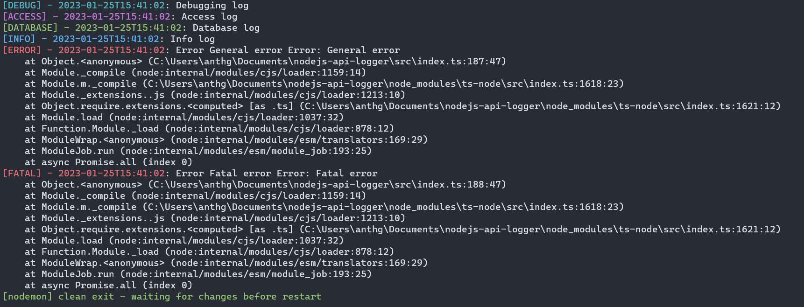
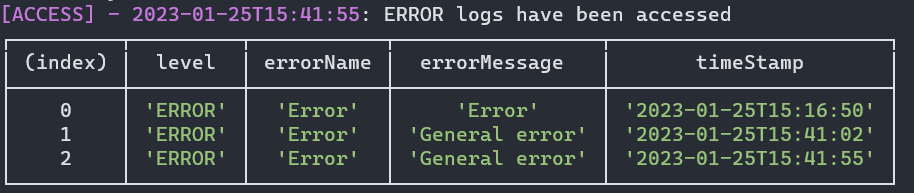

# NodeJs-server-log

## [nodejs-server-log](https://www.npmjs.com/package/nodejs-server-log)

## Description

This is a small package for logging purposes. It logs to the console and writes a file of the specific log in a ./logs directory in the root folder.

### Disclaimer

As of now, the levels of log are the following: info, database,
error, fatal, debug, and access. We will be working on make it more customizable in future releases

## Installation

Follow the commands bellow

```
cd <YourProjectName>
npm i nodejs-server-log
```

## How to use?

```JavaScript
import { log } from "nodejs-server-log";
```

## log

log will allow you to log to the console, and write a file with the specific message

```JavaScript
log({ levelName: 'debug', message: 'Debugging log' })
log({ levelName: 'access', message: 'Access log' })
log({ levelName: 'database', message: 'Database log' })
log({ levelName: 'info', message: 'Info log' })
log({ levelName: 'error', message: '', error: new Error('General error') })
log({ levelName: 'fatal', message: '', error: new Error('Fatal error') })
```

Output:


### readLog

readLogs return a formatted table of the specified logs

```JavaScript
import { readLog } from 'nodejs-server-log'

readLog('error')
```

Output:


## How to contribute

- Fork this repository
- Follow the git commands in your favorite terminal
  ```bash
  git clone git@github.com:<githubUsername>/nodejs-api-logger.git
  cd nodejs-api-logger
  git checkout -b <NameYourNewBranch>
  ```
- After adding your changes please commit the new branch and open a PR
  ```bash
  git add <YourChanges>
  git commit -m <Your changes comments>
  git push origin <Your branch name>
  ```
- Pull Request in GitHub [Pull Request](https://docs.github.com/en/pull-requests/collaborating-with-pull-requests/proposing-changes-to-your-work-with-pull-requests/creating-a-pull-request)
